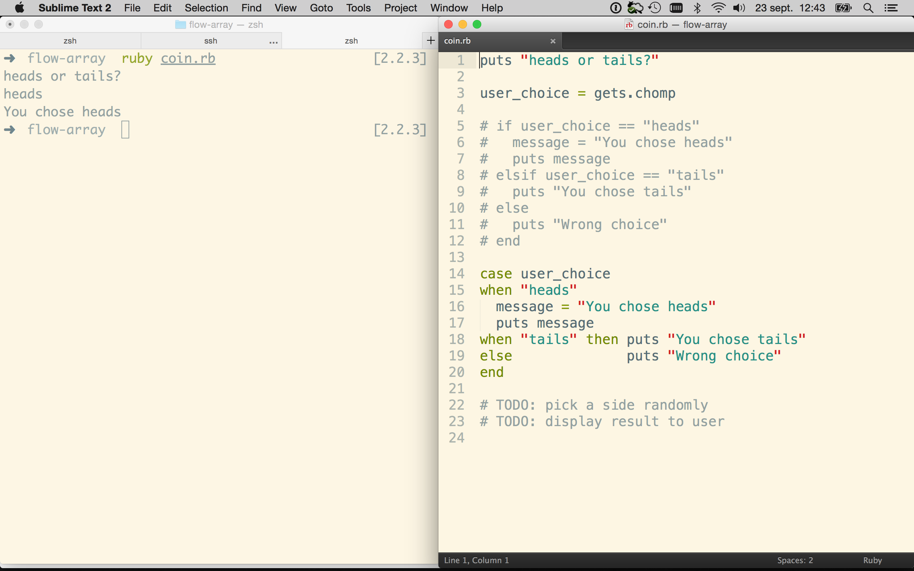

# Teaching @ Le Wagon

Here is a list of guidelines you should follow during a workshop or a lecture.

## Display

The closer your own setup is to the [standard student's one](https://github.com/lewagon/setup),
the better. That way you can share with them keyboard shortcuts. We use [Sublime Text 2](https://github.com/lewagon/setup).

When you are video-projecting your screen, please follow these guidelines:

- The only app running on your computer should be Finder, Sublime Text, Terminal and Browser
- Have your text editor and terminal with a **light background**. You can install the [Solarized](http://ethanschoonover.com/solarized) theme, with the [Sublime Text package](https://github.com/braver/Solarized) and the [OSX terminal theme](https://github.com/tomislav/osx-terminal.app-colors-solarized)
- Zoom a lot your font size (`⌘=`) in Sublime Text and your terminal.
- If you don't have a lot of files, hide the folder drawer on the left with `⌘K, ⌘B`.
- Switch from one file to the other with the `⌘P` (Command Palette)
- You should use two windows layouts:
  - Sublime Text in full screen
  - Vertical split (50/50) with Sublime Text on the right, Terminal on the left



## Tools

### Gist

After a long session of live-coding, usually students ask for the code. They like to keep it on their computer, for future's reference. A quick way to share some code files is to use [Github's gist service](http://gist.github.com/). A quicker way than copy/pasting manually every file is to install the [gist](https://github.com/defunkt/gist) gem on your computer:

```bash
$ brew install gist  # On ubuntu, you can `gem install gist`
```

Then, in an exercise folder, you can run:

```bash
$ gist -p *.rb
```

This will automatically create a private gist with **all the ruby files** in the current folder. The program will give you the gist private URL that you can then share on Slack.


### Floobits

Floobits allow you to share you text editor with the students in their browser. This way, they have the code in front of their eyes, they can copy/paste it to their notes. If you have multiple files, they can browse them independently from you, which is very convinient in a Rails project with a lot of small files.

You can also use this tool in a live-code situation. The idea is that you can allow students to edit in their browser, and changes will be synced back to your own text editor, which is video-projected by the way :)

### Setup

1. Go to [Floobits](https://floobits.com/signup) and sign up with GitHub, it's free
1. Go to the *Settings* tab, you should find instructions to create your `~/.floorc.json` file
1. Install the *Floobits* package using the Package Control in Sublime Text
1. Install the binary [`flootty`](https://github.com/Floobits/flootty) with `pip install Flootty`

### Using Floobits in a lecture/workshop

When doing a lecture, you should have prepare some live code examples to illustrate the slides. So basically, you `mkdir` a new folder, and `stt` into it. From Sublime Text, go to `Tools / Floobits / Share Directory (Public)`. This will give you an URL that you should share with students on Slack.

When you create a new file and you want everybody to be on the page, you can right click in the file, and select `Floobits / Summon`.

To share your terminal session with the students, just run:

```bash
$ flootty
```

### Using Floobits in an interactive live-code

In a live-code, students stay at their seat. You can ask them to edit the code.

After having shared a new workspace, you should go to `https://floobits.com/<USERNAME>/<WORKSPACE>/permissions`. You should check the `Request Perms` option, and save.

That way, students will be able to hit `Collaborate / Request Permission to Edit` to edit the code.


